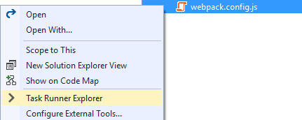
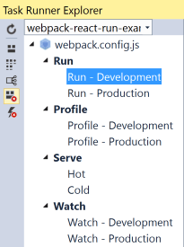

## WebPack Task Runner extension
Adds support for the [WebPack](https://webpack.github.io/)
build tool in Visual Studio 2015's Task Runner Explorer.

Download the extension at the
[VS Gallery](https://visualstudiogallery.msdn.microsoft.com/5497fd10-b1ba-474c-8991-1438ae47012a)
or get the
[nightly build](http://vsixgallery.com/extension/471a020e-77f5-4c77-8ff0-59e08b6c5ba3/)

### Install WebPack
In order to use this extension, you must have
[WebPack](https://webpack.github.io/) installed globally or locally
in your project.

Use [npm](http://npmjs.org/) to install it globally by
typing the following in a command line:

>npm install webpack -g

### Config files
The WebPack Task Runner automatically triggers when it finds
WebPack configuration files. These file names are supported:

1. webpack.config.js
1. webpack.config.babel.js

### Item Template
You can easily add a new **webpack.config.js** file to
your project from the _Add New Item_ dialog.

Just search for "webpack".

### Task Runner Explorer
Open Task Runner Explorer by right-clicking the WebPack
configuration file and select **Task Runner Explorer** from
the context menu:

Task Runner Explorer will show both _run_ and _watch_
tasks.

Each task can be executed by double-clicking the task.

### Switches
WebPack CLI switches are available on the right-hand
side toolbar. The switches are

1. --display-modules
2. --display-reasons
3. --display-chunks

All switches are toggle button that can be left
on or off for as long as needed.

### Bindings
Task bindings make it possible to associate individual tasks
with Visual Studio events such as _Project Open_ etc.

